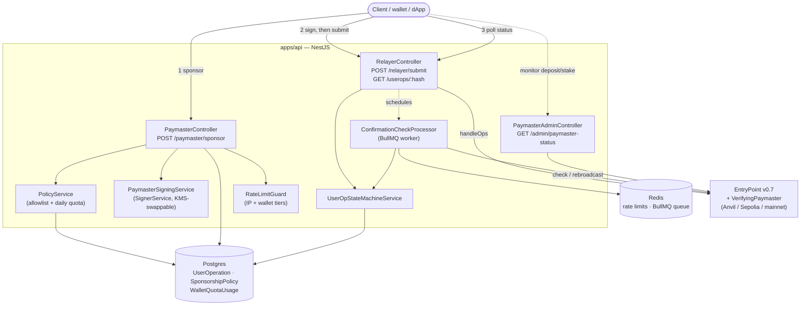
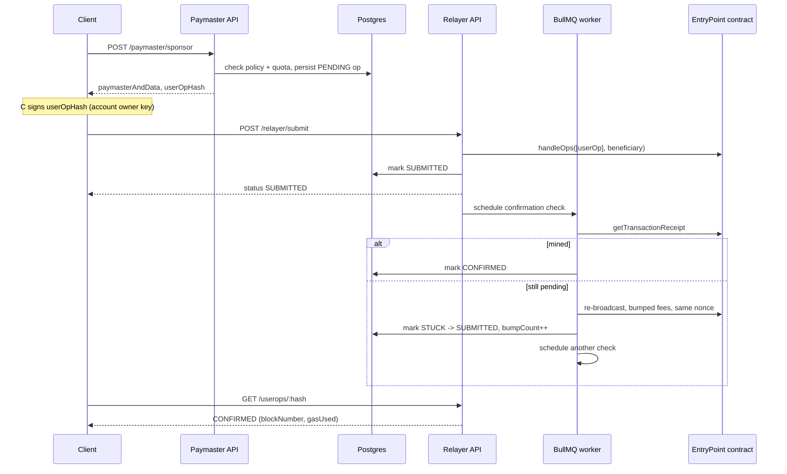

# ERC-4337 Paymaster & Gas Relayer

A production-shaped ERC-4337 Verifying Paymaster and gas relayer/bundler backend: an on-chain paymaster contract (Foundry) plus a NestJS service that signs sponsorship approvals, submits UserOperations on-chain, and recovers automatically when a transaction gets stuck. Built as a complete, runnable reference — not a toy — with real Postgres/Redis/BullMQ, real e2e tests against a real chain, and a one-command Docker Compose demo.

## What it does

1. A dApp/wallet asks this service to sponsor a UserOperation's gas: `POST /paymaster/sponsor`.
2. The service checks the request against a configurable allowlist + daily quota, signs it, and returns `paymasterAndData` — ready to attach to the UserOperation.
3. The account owner signs the returned `userOpHash`, then submits it: `POST /relayer/submit`. This backend acts as its own bundler — no third-party bundler is required.
4. The relayer broadcasts `handleOps` on-chain, tracks it through a `PENDING → SUBMITTED → CONFIRMED/FAILED` state machine, and — if it sits unmined — automatically detects the stuck transaction, bumps gas fees, and re-broadcasts at the same nonce, retrying up to a bounded number of times.
5. `GET /userops/:hash` reports the current status at any point in that lifecycle.

## Architecture



Sequencing of a happy-path request:



## Quickstart (Docker Compose)

```shell
git submodule update --init --recursive   # pulls vendored contract deps (see contracts/README.md)
docker compose up -d --build
```

From a clean clone, this brings up the whole stack with no manual steps: Postgres, Redis, a local Anvil chain, a one-shot `contracts-deploy` job that deploys `VerifyingPaymaster` (+ a fresh `EntryPoint`) to that chain and funds its deposit, and the API itself — which picks up the freshly-deployed addresses automatically. See [apps/api/README.md#docker](apps/api/README.md#docker) for how that wiring works.

```shell
curl http://localhost:5010/health
open http://localhost:5010/docs   # Swagger UI
```

### Full demo: sponsor → sign → submit → confirm

```shell
cd contracts && forge build && cd ..   # compiled artifacts the demo script reads
pnpm demo
```

`apps/api/scripts/demo.ts` reproduces the entire lifecycle against the running stack over plain HTTP + the chain — deploys its own throwaway smart account, requests sponsorship, signs, submits, and polls until the UserOperation is `CONFIRMED` on-chain, printing every step. This is the same flow a real integration would follow; nothing about it is special-cased for testing. See [apps/api/README.md#demo-script](apps/api/README.md#demo-script) for details.

## Why these choices

- **EntryPoint v0.7, not v0.6.** v0.7's `PackedUserOperation` (packed gas fields, separate paymaster gas limits) is the version every current ERC-4337 tooling and the canonical singleton (`0x0000000071727De22E5E9d8BAf0edAc6f37da032`, same address on every network) target today.
- **A verifying paymaster with full sponsorship, not ERC-20/oracle-based payment.** Full sponsorship is the simpler, more common case (a project subsidizes gas outright) and it's the foundation an ERC-20 mode would build on later — see [Deferred / out of scope](#deferred--out-of-scope).
- **This backend is its own bundler**, submitting `handleOps` directly with its own relayer key rather than forwarding to a third-party bundler. Simpler to reason about and to demo end-to-end, at the cost of not aggregating with other paymasters' UserOperations in the same bundle (a real production deployment sponsoring high volume would likely front this with a proper bundler instead).
- **KMS-swappable signing from day one.** `SignerService` (`apps/api/src/modules/crypto`) exposes only `getAddress()`/`signDigest(digest)` — no business logic depends on how signing actually happens. `LocalPrivateKeySigner` is the only implementation today; a KMS-backed one is a drop-in swap behind the same interface, not a rewrite.
- **Postgres for the state machine and policy config, Redis for rate limits and the job queue.** The UserOp lifecycle and quota accounting need real transactional guarantees (`WalletQuotaUsage` is a dedicated atomic counter, not derived by aggregating `UserOperation` rows on the hot path); rate limits and delayed jobs don't, and benefit from Redis's speed instead.
- **Gas-bumping via same-nonce EIP-1559 replacement, not a naive retry.** A stuck transaction is re-broadcast at the same relayer nonce with higher fees — a real fee-replacement the network will actually accept — rather than a new nonce, which would just create a second competing transaction. Bounded retries (`MAX_GAS_BUMP_ATTEMPTS`) prevent an unconfirmable op from retrying forever.

## Repo structure

- `contracts/` — Foundry project: `VerifyingPaymaster.sol` + deploy scripts. See [contracts/README.md](contracts/README.md).
- `apps/api/` — the NestJS backend described above. See [apps/api/README.md](apps/api/README.md) for the full module-by-module tour, every endpoint, and the test suite.
- `apps/dashboard/` — reserved, not built. See [Deferred / out of scope](#deferred--out-of-scope).

## Testing

```shell
cd contracts && forge test               # 18 tests: signature verification, tamper/expiry rejection,
                                          # owner-only admin, network-conditional deploy
pnpm --filter @paymaster/api test        # unit tests
pnpm --filter @paymaster/api test:e2e    # e2e tests against real Postgres/Redis/Anvil — no mocked chain
```

CI (`.github/workflows/ci.yml`) runs `lint`, `contracts`, and `api` as independent jobs on every push/PR.

## Security checklist (before running anywhere but your own machine)

- **Every private key committed to this repo is a publicly-known Anvil test key** (`DEPLOYER_PRIVATE_KEY`, `SIGNER_PRIVATE_KEY`, `RELAYER_PRIVATE_KEY` in `.env.example`/`docker-compose.yml`/CI) — deterministic from Anvil's default test mnemonic, the same ones every Foundry project uses locally. Never fund or reuse any of them on a network with real value.
- **Rotate `SIGNER_PRIVATE_KEY`/`RELAYER_PRIVATE_KEY` for anything real.** Both are placeholders behind the `SIGNER_SERVICE`/`RELAYER_SIGNER_SERVICE` abstraction (`modules/crypto`) specifically so a KMS-backed signer is a drop-in swap later — see `signer.factory.ts`.
- **Set a real `ADMIN_API_KEY`** (`openssl rand -hex 32`) before exposing `GET /admin/paymaster-status` beyond local Docker Compose — see [apps/api/README.md#admin-paymaster-depositstake-monitoring](apps/api/README.md#admin-paymaster-depositstake-monitoring). Leaving it unset disables the endpoint (503) rather than leaving it open.
- **Configure `trust proxy` correctly if you put the API behind a reverse proxy** — see [apps/api/README.md#rate-limiting](apps/api/README.md#rate-limiting). The default (unset) is safe but wrong behind a proxy; `true`/`'*'` is unsafe everywhere.
- **`.env` files are gitignored** (`.env.example` files are the only tracked variants) — double-check `git status` before committing if you've been editing local env files.

## Deferred / out of scope

Deliberately not built, so the boundary is explicit rather than something a reader has to infer from absence:

- **ERC-20 / oracle-based gas payment.** This paymaster only sponsors gas outright (full sponsorship). Adding a mode where the sender pays in an ERC-20 token via a price oracle is a real extension, not implemented here — `VerifyingPaymaster` would need a second validation path and `PaymasterSigningService` a price-quoting step.
- **`apps/dashboard/`.** Reserved for a future internal ops UI (policy management, live UserOp status, deposit/stake visibility) reading from `apps/api`'s endpoints — `GET /admin/paymaster-status` (Phase 14) covers the read-only monitoring piece a dashboard would otherwise need to build from scratch. No code lives there yet.
- **KMS-backed signing.** The `SignerService` interface is built for this (see above) but only `LocalPrivateKeySigner` exists; wiring an actual AWS KMS/GCP KMS implementation behind `SIGNER_BACKEND=kms` is future work, not a missing piece of the current design.
- **Third-party bundler integration / UserOperation mempool participation.** This service submits directly as its own bundler (see [Why these choices](#why-these-choices)); it doesn't implement the ERC-4337 bundler RPC spec (`eth_sendUserOperation`, mempool validation rules, etc.) or aggregate UserOperations from other paymasters.
- **Multi-chain in a single running instance.** One `CHAIN_ID`/`CHAIN_RPC_URL` per deployment. Running against multiple chains means multiple deployments today, not a chain-selector in the request.

## Contributing

See [CONTRIBUTING.md](CONTRIBUTING.md) for local setup, test commands, and conventions.

## License

MIT (with one GPL-3.0 exception) — see [LICENSE](LICENSE).
